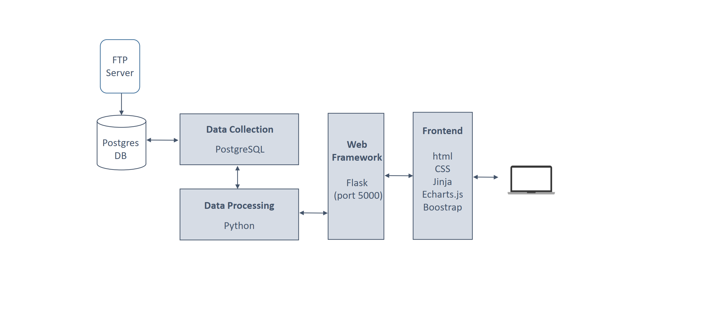
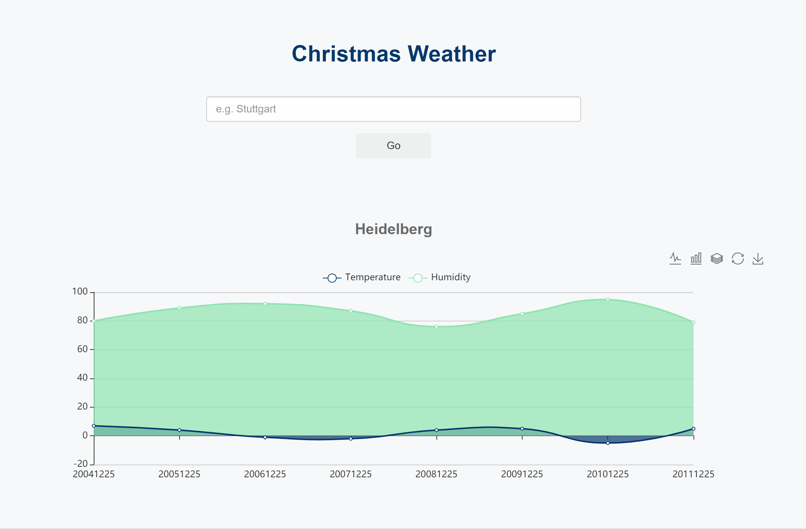

# Quality-Match Assignment


## Task Description
Create a web-frontend application e.g. with react (or simple HTML) which connects to the German weather service system and shows a graph of e.g. temperature of the last years (feel free to interpret this as you like, maybe some statistics or the last year or christmases of the last 10 years, …).


## Dataset
- DWD Climate Data Center: Historical hourly station observations of 2m air temperature and humidity for Germany, version
v006, 2018
- https://opendata.dwd.de/climate_environment/CDC/observations_germany/climate/hourly/air_temperature/historical/
- Considering the demo usage of this application and the large data size, I selected 30 stations from the station
overview list (‘TU_Studenwerte_Beschreibung_Station.txt’) which are scatted across the whole Baden-Würtenberg. Moreover,
not every station in the overview list has corresponding weather dataset, so at the end, 28 station observations are used in this
app

## Architecture Design


## Folder Structure
```
+-- QualityMatchAssignment
    +-- data_load       # (one-time execution) load data from ftp to db
        +-- data_load.py
        +-- ftp_to_db.py
    +-- dataset         # a folder used to store all dowloaded data
            +-- clean_station_list.csv
            +-- [all dowloaded data]
    +-- static
        +-- chart.js
        +-- style.css
    +-- templates
        +-- dashboard.html
    +-- app.py          # flask app
    +-- config.py       # configuration for db and ftp server connection
    +-- data.py         # query and process data
```

## Set Up
**Prerequisite:**
```
PostgreSQL (database)
psycopg2e
flask
geopy
ftplib
pandas
zipfile
```
**Configure:** maintain your db connection parameters in config.py

## Run
```
1) load data into postgresDB: python data_load.py
2) run web-app: python app.py [postgres password]
```

## Demo:
- Input: a city name (better in Baden-Württenberg)
- Output: a temperature/humidity chart with interactive legend




